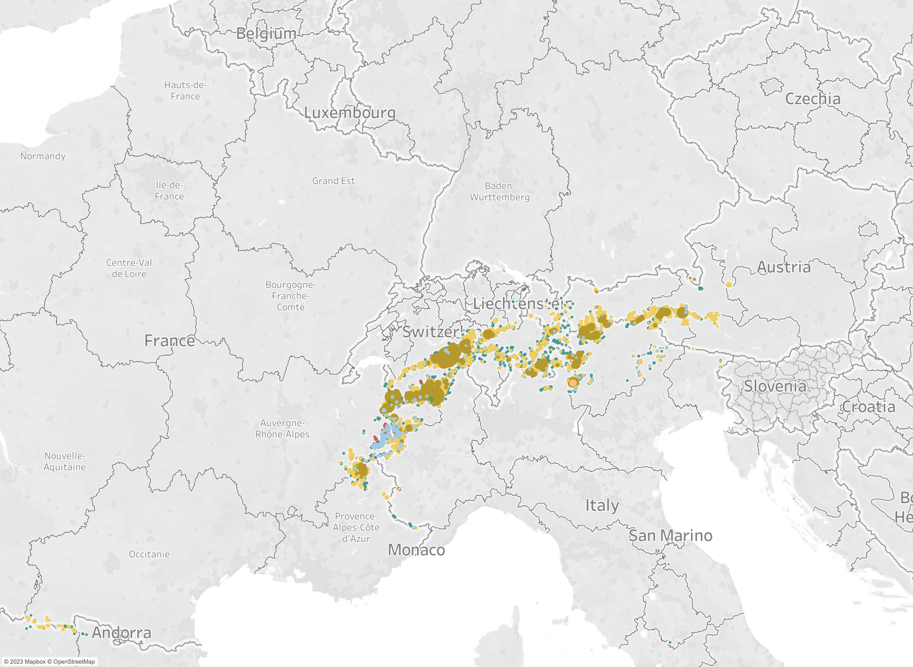

<html>
    <head>
        
    </head>
<body>
    <table>
        <tr>
            <td id="leftColumn">
                <button onclick="show(0)" style="background-color: #A0CBE8;">Miscellaneous</button>
                <button onclick="show(1)" style="background-color: #FFBE7D;">Ice Field</button>
                <button onclick="show(2)" style="background-color: #59A14F;">Ice Cap</button>
                <button onclick="show(3)" style="background-color: #8CD17D;">Outlet Glacer</button>
                <button onclick="show(4)" style="background-color: #B6992D;">Valley Glacier</button>
                <button onclick="show(5)" style="background-color: #F1CE63;">Mountain Glacier</button>
                <button onclick="show(6)" style="background-color: #499894;">Glacieret and Snowfield</button>
                <button onclick="show(7)" style="background-color: #86BCB6;">Ice Shelf</button>
                <button onclick="show(8)" style="background-color: #E15759;">Rock Glacier</button>
                <button onclick="show(9)" onmouseover="cycleHoverColor(this)" style="background-color: black;">All</button>
            </td>
            <td id="centerColumn">
                

            </td>
            <td id="rightColumn">
                
            </td>
        </tr>
    </table>
    
</body>

</html>
